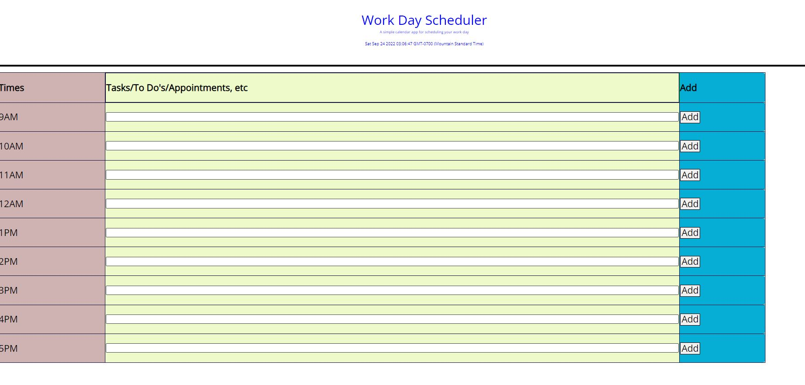
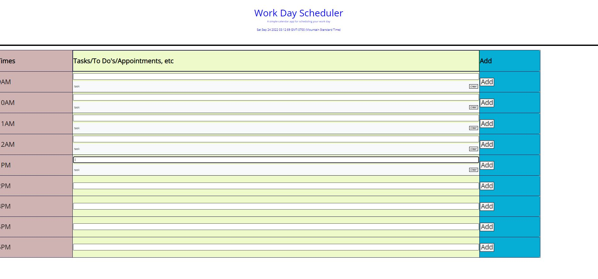

# UofA-Module5-WorkDayScheduler-LSandura
Fifth Bootcamp Module 5 Challenge completed by Laura Sandura

Main Objective: 
Create calendar app that allows a person to save events for each hour of the day which runs in browser using HTML, CSS and jQuery.

Challenge: 
Help an employee manage their busy schedule by allowing them to add events to a daily planner so they can handle their time in an effective way.

Additional Expectations:
  The current day is displayed at the top of the calendar
  Timeblocks are presented for standard business hours
  Time blocks are color coded for past, present and future
  Timeblocks are clickable to enter the event
  Text can be added and saved to local storage with a save button
  If the page is refreshed the saved events are not cleared
    
Assignment Example Pictures:
    
Assignment Example with some tasks:
    
    
Repository link where finalized project can be pulled:
    https://github.com/laurabora118/UofA-Module5-WorkDayScheduler-LSandura

Git Repository Site that shows finalized project results:
    https://laurabora118.github.io/UofA-Module5-WorkDayScheduler-LSandura/
    
References:
    1 - Assignment criteria and starter code was received in UofA assignment 

    2 - Moment.js (https://momentjs.com/)

